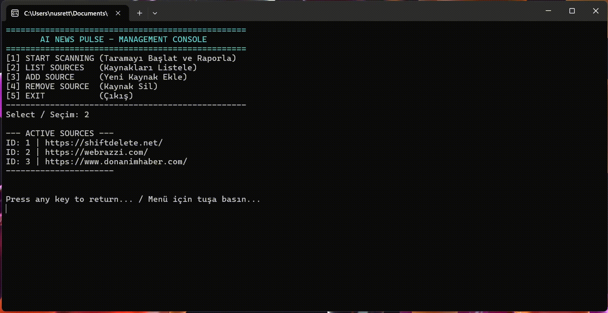
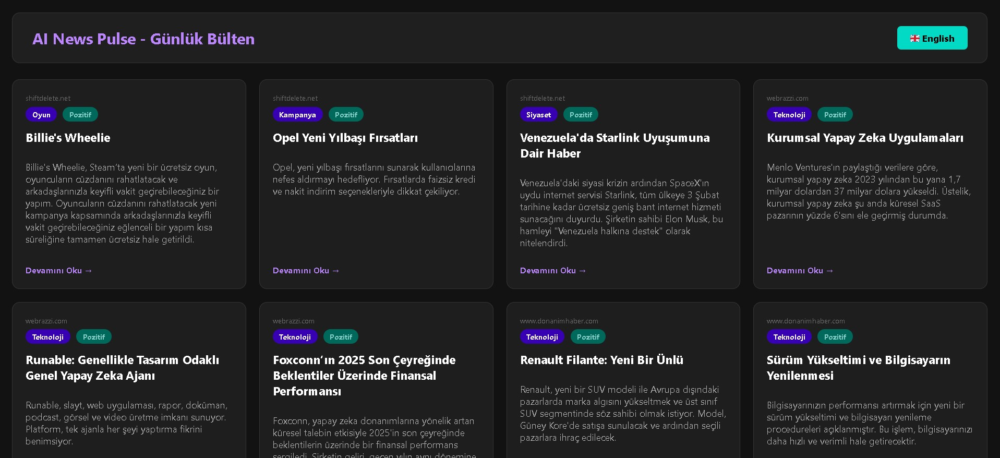
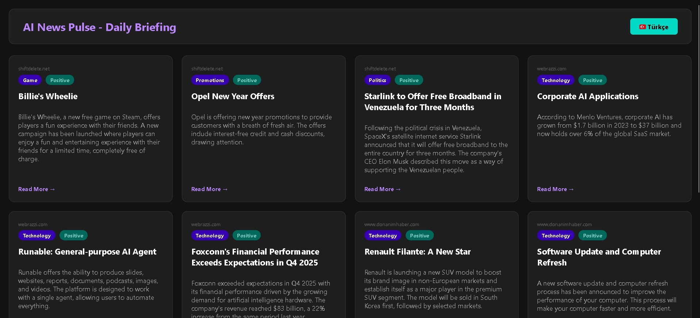
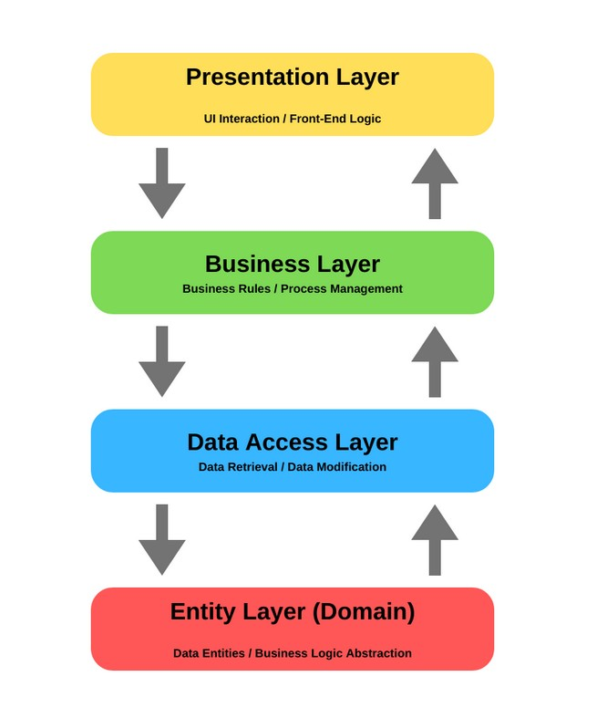

# 📰 AiNewsPulse - AI-Powered News Intelligence Platform


**[ [English](#-english) | [Türkçe](#-türkçe) ]**

---

<a name="-english"></a>
## 🌐 English

AiNewsPulse is an intelligent news intelligence platform that leverages **local LLM models** to scrape, analyze, summarize, and generate multilingual (TR/EN) reports from various news sources.

> **Vision:** A privacy-first news aggregation system that processes everything locally. Built with **N-Layer Architecture**, featuring **Deep Scraping**, **AI-Powered Analysis**, and **Dynamic HTML Reporting**.

---

## 📸 Project Preview (Demo)

### 1. Application Workflow & Features
Smart news scraping with AI-powered analysis and interactive multilingual reports.

| Feature | Preview |
| :---: | :---: |
| **Console Interface** |  |
| **HTML Report (TR)** |  |
| **HTML Report (EN)** |  |

---

## 🏗 Architecture Structure (N-Layer Architecture)

The project follows **Clean Architecture** principles with loosely coupled layers.



* **🧱 Core Layer:** Entities (News, Source, AIAnalysis) and Interfaces. Zero external dependencies.
* **💾 Infrastructure Layer:** Database (EF Core + SQLite), AI Service (Ollama), Web Scraper implementations.
* **⚙️ Application Layer:** Business Logic, NewsManager orchestration, workflow management.
* **💻 ConsoleUI Layer:** User interaction, Dependency Injection configuration, menu system.

---

## 🚀 Technical Features and Solutions

### 🔍 1. Smart Web Scraping
Advanced scraping capabilities with encoding management and compression support.
* **Compression Support:** Handles Gzip/Brotli compression from any website.
* **Encoding Management:** Automatic UTF-8 detection and character error correction (fixes ÷, â, etc.).
* **Duplicate Prevention:** Smart algorithm prevents re-scraping previously analyzed articles.
* **Error Handling:** Robust retry mechanism with timeout management.

### 🧠 2. Local AI Integration (Ollama)
Privacy-first AI processing without sending data to external APIs.
* **Multi-Model Support:** Works with Llama 3.2, Gemma2, Mistral, and other Ollama models.
* **JSON Mode Enforcement:** Guarantees 100% structured data output from AI responses.
* **Comprehensive Analysis:** 
  - 📝 Article Summarization (TR/EN)
  - 🏷️ Category Classification
  - 💭 Sentiment Analysis (Positive/Negative/Neutral)
* **Configurable:** Easily switch models and adjust temperature/creativity settings.

### 🌍 3. Multilingual Intelligence
Dual-language processing for Turkish and English audiences.
* **Simultaneous Analysis:** Processes news in both languages in a single AI call.
* **Language-Aware Sentiment:** Accurate sentiment detection for each language.
* **Interactive Reports:** One-click language switching in HTML output.

### 📊 4. Dynamic HTML Reporting
Auto-generated modern reports with interactive features.
* **Dark Mode:** Eye-friendly dark theme included by default.
* **Responsive Design:** Works seamlessly on desktop and mobile devices.
* **JavaScript-Powered:** Real-time language switching without page reload.
* **Auto-Open:** Report automatically opens in browser after scanning.

### ⚡ 5. Performance and Scalability
* **Async/Await:** All I/O operations are asynchronous for better concurrency.
* **SQLite:** Lightweight, file-based database requiring no server setup.
* **Efficient Queries:** LINQ optimizations ensure minimal data transfer.

---

## 🛠 Installation and Running

### Prerequisites
Before starting, ensure you have:
* [.NET 9.0 SDK](https://dotnet.microsoft.com/download/dotnet/9.0)
* [Ollama](https://ollama.ai/) (installed and running)
* [Docker Desktop](https://www.docker.com/products/docker-desktop/) (Optional - for containerized deployment)

### Step 1: Clone the Repository
```bash
git clone https://github.com/YOUR_USERNAME/AiNewsPulse.git
cd AiNewsPulse
```

### Step 2: Install AI Model
Download Llama 3.2 (or your preferred model):
```bash
ollama pull llama3.2
```

**Supported Models:**
- `llama3.2` (recommended - balanced performance)
- `llama3:70b` (high accuracy, requires more resources)
- `gemma2` (lightweight alternative)
- `mistral` (fast and efficient)

### Step 3: Configure Settings (Optional)
Edit `appsettings.json` if needed:
```json
{
  "AiSettings": {
    "ModelId": "llama3.2",
    "Temperature": 0.7
  }
}
```

### Step 4: Build & Run

#### Option A: Run Locally (Recommended for Development)
```bash
cd AiNewsPulse.ConsoleUI
dotnet restore
dotnet run
```

#### Option B: Run with Docker Compose 🐳 (Recommended)
Since the project includes a `docker-compose.yml` configuration:

1. Open terminal in project root.
2. Run the application:
   ```bash
   docker-compose up --build
   ```

> **Note:** This command automatically handles networking (to reach local Ollama), volume mapping for reports/database, and environment variables. Generated reports will appear in the `output/` folder.

---

## 📖 Usage Guide

### Interactive Console Menu

| Command | Description |
| :--- | :--- |
| **1. Start Scanning** | Scrapes all registered sources, performs AI analysis, generates HTML report |
| **2. Add Source** | Register new news sources (RSS feeds or web URLs) |
| **3. List Sources** | View all registered news sources with IDs |
| **4. Remove Source** | Delete a source by ID |
| **5. Exit** | Close the application |

### Example Workflow
```bash
# Add a news source
> Select option: 2
> Enter source name: TechCrunch AI
> Enter URL: https://techcrunch.com/category/artificial-intelligence/feed/

# Start scanning
> Select option: 1
[INFO] Starting news scan...
[INFO] Fetching from 3 sources...
[INFO] Found 25 new articles
[AI] Analyzing with Llama 3.2...
[SUCCESS] Analysis complete! Generated report: output/report_20260106.html
[BROWSER] Opening report...
```

---

## ⚙️ Configuration Options

| Setting | Description | Default | Options |
| :--- | :--- | :--- | :--- |
| `ModelId` | Ollama model to use | `llama3.2` | `llama3.2`, `gemma2`, `mistral` |
| `Temperature` | AI creativity level | `0.7` | `0.0` (focused) - `1.0` (creative) |
| `LogLevel` | Console verbosity | `Warning` | `Debug`, `Info`, `Warning`, `Error` |

---

## 🧪 Technical Highlights

### Code Quality
* ✅ **SOLID Principles:** Dependency Inversion, Single Responsibility
* ✅ **Design Patterns:** Repository Pattern, Dependency Injection
* ✅ **Async/Await:** Non-blocking I/O operations throughout
* ✅ **Error Handling:** Comprehensive try-catch with user-friendly messages

### AI Prompt Engineering
The system uses carefully crafted prompts to ensure consistent JSON output:
```csharp
// Example: Forcing structured output
var prompt = @"Analyze this article and respond ONLY with valid JSON.
{
  ""summaryTR"": ""Turkish summary here"",
  ""summaryEN"": ""English summary here"",
  ""category"": ""Technology"",
  ""sentiment"": ""Positive""
}";
```

---

## 📦 Project Structure

```
AiNewsPulse/
├── 📂 AiNewsPulse.Core/
│   ├── Entities/
│   │   ├── News.cs
│   │   ├── Source.cs
│   │   └── AIAnalysis.cs
│   └── Interfaces/
│       ├── INewsRepository.cs
│       └── IAIService.cs
│
├── 📂 AiNewsPulse.Infrastructure/
│   ├── Data/
│   │   ├── AppDbContext.cs
│   │   └── NewsRepository.cs
│   ├── AI/
│   │   └── OllamaService.cs
│   └── Scraping/
│       └── NewsScraper.cs
│
├── 📂 AiNewsPulse.Application/
│   └── Services/
│       └── NewsManager.cs
│
└── 📂 AiNewsPulse.ConsoleUI/
    ├── Program.cs
    ├── appsettings.json
    └── output/ (generated reports)
```

---

### 📞 Contact & Links

<a href="https://www.linkedin.com/in/YOUR_PROFILE">
  
</a>
<a href="https://github.com/YOUR_USERNAME/AiNewsPulse">
  
</a>

---

### 🤝 Contributing

Contributions are welcome! Whether it's better prompt engineering, new language support, or database integrations.

1. Fork the repository
2. Create a feature branch (`git checkout -b feature/amazing-feature`)
3. Commit your changes (`git commit -m 'feat: Add amazing feature'`)
4. Push to the branch (`git push origin feature/amazing-feature`)
5. Open a Pull Request

---

### 📝 Developer Notes

> **Note on AI Quality:** The accuracy of categorization and sentiment analysis depends on the local LLM model's capabilities. For more precise results, consider using larger parameter models (e.g., `llama3:70b` or `mixtral:8x7b`).

---

**⭐ If you find this project useful, don't forget to give it a star!**

---
---

<a name="-türkçe"></a>
## 🇹🇷 Türkçe

AiNewsPulse, **yerel LLM modelleri** kullanarak haberleri tarayan, analiz eden, özetleyen ve çok dilli (TR/EN) raporlar sunan akıllı bir haber istihbarat platformudur.

> **Vizyon:** Gizlilik odaklı, her şeyi yerel olarak işleyen bir haber toplama sistemi. **N-Katmanlı Mimari** ile geliştirilmiş, **Derin Kazıma**, **Yapay Zeka Destekli Analiz** ve **Dinamik HTML Raporlama** özelliklerine sahiptir.

---

## 📸 Proje Önizlemesi (Demo)

### 1. Uygulama İş Akışı & Özellikler
Yapay zeka destekli akıllı haber kazıma ve etkileşimli çok dilli raporlar.

| Özellik | Önizleme |
| :---: | :---: |
| **Konsol Arayüzü** |  |
| **HTML Rapor (TR)** |  |
| **HTML Rapor (EN)** |  |

---

## 🏗 Mimari Yapı (N-Layer Architecture)

Proje, **Clean Architecture** prensiplerine uygun gevşek bağlı katmanlarla tasarlanmıştır.


* **🧱 Core Layer:** Entity'ler (News, Source, AIAnalysis) ve Arayüzler. Dışa bağımlılığı yoktur.
* **💾 Infrastructure Layer:** Veritabanı (EF Core + SQLite), AI Servisi (Ollama), Web Scraper implementasyonları.
* **⚙️ Application Layer:** İş mantığı, NewsManager orkestrasyon, iş akışı yönetimi.
* **💻 ConsoleUI Layer:** Kullanıcı etkileşimi, Dependency Injection yapılandırması, menü sistemi.

---

## 🚀 Teknik Özellikler ve Çözümler

### 🔍 1. Akıllı Web Kazıma (Smart Scraping)
Gelişmiş kazıma yetenekleri ile encoding yönetimi ve sıkıştırma desteği.
* **Sıkıştırma Desteği:** Her türlü siteden Gzip/Brotli sıkıştırması ile veri çekebilme.
* **Encoding Yönetimi:** Otomatik UTF-8 algılama ve karakter hatası düzeltme (÷, â vb.).
* **Tekrar Tarama Engelleme:** Daha önce analiz edilmiş haberleri tekrar taramayan akıllı algoritma.
* **Hata Yönetimi:** Timeout yönetimi ile güçlü yeniden deneme mekanizması.

### 🧠 2. Yerel Yapay Zeka Entegrasyonu (Ollama)
Gizlilik öncelikli, dış API'lere veri göndermeden AI işleme.
* **Çoklu Model Desteği:** Llama 3.2, Gemma2, Mistral ve diğer Ollama modelleri ile çalışır.
* **JSON Mode Zorlaması:** AI yanıtlarından %100 yapılandırılmış veri çıktısı garantisi.
* **Kapsamlı Analiz:** 
  - 📝 Makale Özetleme (TR/EN)
  - 🏷️ Kategori Sınıflandırma
  - 💭 Duygu Analizi (Pozitif/Negatif/Nötr)
* **Yapılandırılabilir:** Model değiştirme ve temperature/yaratıcılık ayarları kolay.

### 🌍 3. Çoklu Dil Zekası
Türkçe ve İngilizce kitleler için eş zamanlı dil işleme.
* **Eşzamanlı Analiz:** Tek bir AI çağrısında her iki dilde de haber işleme.
* **Dile Özel Duygu:** Her dil için doğru duygu tespiti.
* **Etkileşimli Raporlar:** HTML çıktısında tek tıkla dil değiştirme.

### 📊 4. Dinamik HTML Raporlama
Etkileşimli özelliklerle otomatik oluşturulan modern raporlar.
* **Karanlık Mod:** Varsayılan olarak göz dostu karanlık tema.
* **Responsive Tasarım:** Masaüstü ve mobil cihazlarda sorunsuz çalışır.
* **JavaScript Destekli:** Sayfa yenileme olmadan gerçek zamanlı dil değiştirme.
* **Otomatik Açılma:** Tarama sonrası rapor otomatik olarak tarayıcıda açılır.

### ⚡ 5. Performans ve Ölçeklenebilirlik
* **Async/Await:** Daha iyi eşzamanlılık için tüm I/O operasyonları asenkron.
* **SQLite:** Sunucu kurulumu gerektirmeyen hafif, dosya tabanlı veritabanı.
* **Verimli Sorgular:** LINQ optimizasyonları minimal veri transferi sağlar.

---

## 🛠 Kurulum ve Çalıştırma

### Ön Gereksinimler
Başlamadan önce bunların yüklü olduğundan emin olun:
* [.NET 9.0 SDK](https://dotnet.microsoft.com/download/dotnet/9.0)
* [Ollama](https://ollama.ai/) (yüklü ve çalışıyor)
* [Docker Desktop](https://www.docker.com/products/docker-desktop/) (Opsiyonel - Konteyner ile çalıştırmak için)

### Adım 1: Projeyi Klonlayın
```bash
git clone https://github.com/KULLANICI_ADIN/AiNewsPulse.git
cd AiNewsPulse
```

### Adım 2: AI Modelini Yükleyin
Llama 3.2'yi (veya tercih ettiğiniz modeli) indirin:
```bash
ollama pull llama3.2
```

**Desteklenen Modeller:**
- `llama3.2` (önerilen - dengeli performans)
- `llama3:70b` (yüksek doğruluk, daha fazla kaynak gerektirir)
- `gemma2` (hafif alternatif)
- `mistral` (hızlı ve verimli)

### Adım 3: Ayarları Yapılandırın (İsteğe Bağlı)
Gerekirse `appsettings.json` dosyasını düzenleyin:
```json
{
  "AiSettings": {
    "ModelId": "llama3.2",
    "Temperature": 0.7
  }
}
```

### Adım 4: Derleyin & Çalıştırın

#### Seçenek A: Yerel Olarak Çalıştırın (Geliştirme İçin Önerilen)
```bash
cd AiNewsPulse.ConsoleUI
dotnet restore
dotnet run
```

#### Seçenek B: Docker Compose ile Çalıştırın 🐳 (Önerilen)
Proje `docker-compose.yml` yapılandırmasını içerdiği için:

1. Proje ana dizininde terminali açın.
2. Uygulamayı başlatın:
   ```bash
   docker-compose up --build
   ```

> **Not:** Bu komut; ağ ayarlarını (Ollama erişimi), raporlar ve veritabanı için klasör eşlemeyi ve ortam değişkenlerini otomatik yapılandırır. Oluşturulan raporlar `output/` klasörüne düşecektir.

---

## 📖 Kullanım Kılavuzu

### Etkileşimli Konsol Menüsü

| Komut | Açıklama |
| :--- | :--- |
| **1. Taramayı Başlat** | Tüm kayıtlı kaynakları tarar, AI analizi yapar, HTML raporu oluşturur |
| **2. Kaynak Ekle** | Yeni haber kaynakları (RSS feed veya web URL'leri) kaydet |
| **3. Kaynakları Listele** | ID'leri ile birlikte tüm kayıtlı haber kaynaklarını görüntüle |
| **4. Kaynak Sil** | ID ile kaynak sil |
| **5. Çıkış** | Uygulamayı kapat |

### Örnek İş Akışı
```bash
# Haber kaynağı ekle
> Seçenek: 2
> Kaynak adı: TechCrunch AI
> URL: https://techcrunch.com/category/artificial-intelligence/feed/

# Taramayı başlat
> Seçenek: 1
[BİLGİ] Haber taraması başlatılıyor...
[BİLGİ] 3 kaynaktan veri çekiliyor...
[BİLGİ] 25 yeni makale bulundu
[AI] Llama 3.2 ile analiz ediliyor...
[BAŞARILI] Analiz tamamlandı! Rapor oluşturuldu: output/report_20260106.html
[TARAYICI] Rapor açılıyor...
```

---

## ⚙️ Yapılandırma Seçenekleri

| Ayar | Açıklama | Varsayılan | Seçenekler |
| :--- | :--- | :--- | :--- |
| `ModelId` | Kullanılacak Ollama modeli | `llama3.2` | `llama3.2`, `gemma2`, `mistral` |
| `Temperature` | AI yaratıcılık seviyesi | `0.7` | `0.0` (odaklı) - `1.0` (yaratıcı) |
| `LogLevel` | Konsol detay seviyesi | `Warning` | `Debug`, `Info`, `Warning`, `Error` |

---

## 🧪 Teknik Öne Çıkanlar

### Kod Kalitesi
* ✅ **SOLID Prensipleri:** Bağımlılık Tersine Çevirme, Tek Sorumluluk
* ✅ **Tasarım Desenleri:** Repository Pattern, Dependency Injection
* ✅ **Async/Await:** Baştan sona bloklanmayan I/O operasyonları
* ✅ **Hata Yönetimi:** Kullanıcı dostu mesajlarla kapsamlı try-catch

### AI Prompt Mühendisliği
Sistem, tutarlı JSON çıktısı sağlamak için özenle hazırlanmış promptlar kullanır:
```csharp
// Örnek: Yapılandırılmış çıktı zorlama
var prompt = @"Bu makaleyi analiz et ve SADECE geçerli JSON ile yanıt ver.
{
  ""summaryTR"": ""Türkçe özet buraya"",
  ""summaryEN"": ""English summary here"",
  ""category"": ""Teknoloji"",
  ""sentiment"": ""Pozitif""
}";
```

---

## 📦 Proje Yapısı

```
AiNewsPulse/
├── 📂 AiNewsPulse.Core/
│   ├── Entities/
│   │   ├── News.cs
│   │   ├── Source.cs
│   │   └── AIAnalysis.cs
│   └── Interfaces/
│       ├── INewsRepository.cs
│       └── IAIService.cs
│
├── 📂 AiNewsPulse.Infrastructure/
│   ├── Data/
│   │   ├── AppDbContext.cs
│   │   └── NewsRepository.cs
│   ├── AI/
│   │   └── OllamaService.cs
│   └── Scraping/
│       └── NewsScraper.cs
│
├── 📂 AiNewsPulse.Application/
│   └── Services/
│       └── NewsManager.cs
│
└── 📂 AiNewsPulse.ConsoleUI/
    ├── Program.cs
    ├── appsettings.json
    └── output/ (oluşturulan raporlar)
```

---

### 📞 İletişim & Bağlantılar

<a href="https://www.linkedin.com/in/PROFILINIZ">
  
</a>
<a href="https://github.com/KULLANICI_ADIN/AiNewsPulse">
  
</a>

---

### 🤝 Katkıda Bulunma

Katkılar memnuniyetle karşılanır! Daha iyi prompt mühendisliği, yeni dil desteği veya veritabanı entegrasyonları için.

1. Repository'yi fork edin
2. Feature branch oluşturun (`git checkout -b feature/amazing-feature`)
3. Değişikliklerinizi commit edin (`git commit -m 'feat: Harika özellik eklendi'`)
4. Branch'inizi push edin (`git push origin feature/amazing-feature`)
5. Pull Request oluşturun

---

### 📝 Geliştirici Notları

> **AI Kalitesi Hakkında Not:** Kategorizasyon ve duygu analizi doğruluğu, yerel LLM modelinin yeteneklerine bağlıdır. Daha kesin sonuçlar için daha büyük parametreli modeller (örn: `llama3:70b` veya `mixtral:8x7b`) tercih edilebilir.

---

**⭐ Projeyi faydalı bulduysanız yıldız vermeyi unutmayın!**